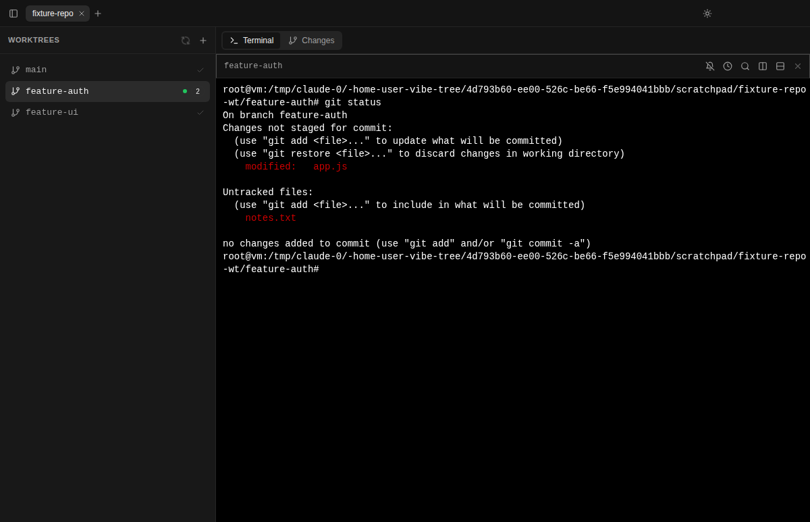

<div align="center">
  

# VibeTree

**Run every AI coding agent in its own git worktree, in parallel.**

[](https://opensource.org/licenses/MIT)
[](https://github.com/sahithvibudhi/vibe-tree/releases)
[](https://github.com/sahithvibudhi/vibe-tree/actions/workflows/ci.yml)

Works with Claude Code, OpenAI Codex CLI, Gemini CLI, Aider, opencode, and any other terminal program.

</div>

---

VibeTree is mission control for parallel AI coding agents. Every task gets its own git worktree: an isolated checkout with its own branch and a persistent terminal. Run one agent per worktree, watch them all at once, review each branch's diff, and throw away failed experiments with one click. Use it as a desktop app, or run the server and drive your agents from any browser, including your phone.

## Screenshot



## Demo


<!-- TODO: refresh screenshot showing parallel terminals running claude + aider side by side -->

## Why worktrees

- Parallel agents do not stomp on each other: each works in its own checkout on its own branch
- Every conversation maps to one reviewable diff; review and merge per branch
- Failed experiment? Delete the worktree and its branch is gone with it

## Quick start

### Desktop app

Download the latest dmg, exe, or AppImage from the [Releases page](https://github.com/sahithvibudhi/vibe-tree/releases), or run from source:

```bash
pnpm install
pnpm dev:desktop
```

### Server + web (browser and phone)

```bash
pnpm install
pnpm dev:all        # server + web dev servers; scan the QR code with your phone
```

Single-process production deployment (one server serves the UI and the API):

```bash
pnpm build
pnpm start:server   # http://localhost:3002
```

Or with Docker:

```bash
npm run deploy
```

The web app is an installable PWA: open it on your phone, add it to your home screen, and check on your agents from anywhere on your network.

## Features

| Feature | Description |
| --- | --- |
| Parallel worktrees | One isolated checkout, branch, and terminal per task |
| Any AI CLI | It is a real terminal: claude, codex, gemini, aider, or plain shells |
| Persistent sessions | Terminals keep running and their scrollback survives reloads and reconnects |
| Lifecycle hooks | Run your own scripts when worktrees are created or removed |
| Git diff view | Review unstaged and staged changes per worktree |
| Command scheduler | Queue a command to run in a terminal after a delay, once or repeatedly |
| Desktop notifications | Get notified when your agent finishes or asks a question (desktop) |
| IDE integration | Open any worktree in VS Code or Cursor (desktop) |
| Remote access | Web UI over HTTP/WebSocket with QR pairing for phones |
| Dark/light mode | Follows your system, with manual override |

## Worktree hooks

Automate per-worktree setup and teardown by adding executable scripts to your repository, using the same trust model as git hooks:

```bash
mkdir -p .vibetree/hooks

cat > .vibetree/hooks/post-create <<'EOF'
#!/bin/sh
# Runs in the new worktree after it is created
cp "$VIBETREE_PROJECT_PATH/.env" .env 2>/dev/null || true
npm install
EOF

cat > .vibetree/hooks/pre-remove <<'EOF'
#!/bin/sh
# Runs in the worktree before it is removed; failure warns but never blocks
docker compose down 2>/dev/null || true
EOF

chmod +x .vibetree/hooks/post-create .vibetree/hooks/pre-remove
```

Hooks receive `VIBETREE_HOOK`, `VIBETREE_PROJECT_PATH`, `VIBETREE_WORKTREE_PATH`, and `VIBETREE_BRANCH`. Output is captured and surfaced in the UI; a 120 second timeout kills hung scripts.

## Security

- The desktop app embeds its server on 127.0.0.1 with a per-launch token; nothing is exposed to the network.
- The standalone server binds 0.0.0.0 by default so phones can reach it. Authentication is off by default; to require a login, set:

```bash
AUTH_REQUIRED=true
VIBETREE_USERNAME=you
VIBETREE_PASSWORD=a-strong-password
```

The server warns at startup when it is network-reachable without auth. See `apps/server/.env.example` for all options, including LAN development mode.

## Architecture

A pnpm + Turborepo monorepo. Desktop and web share one backend: the same server core is embedded by the Electron app and run standalone for the web.

```
apps/
  desktop/       Electron app (embeds the server on loopback)
  web/           React PWA (talks to the server over WebSocket)
  server/        Standalone server CLI (QR pairing, static web serving)
packages/
  core/          Git and PTY session logic, shared types, WebSocket adapter
  server-core/   Express + WebSocket server, auth, REST API
  ui/            Shared terminal component
  auth/          Login page and auth context for the web app
```

See [ARCHITECTURE.md](ARCHITECTURE.md) for details, and [DOCKER.md](DOCKER.md) for cloud deployment.

## Development

```bash
pnpm install
pnpm dev:desktop   # desktop app
pnpm dev:all       # server + web
pnpm test:run      # unit tests
pnpm --filter @vibetree/desktop test:e2e   # desktop e2e (Playwright)
pnpm --filter @vibetree/web test:e2e       # web e2e (Playwright)
pnpm typecheck && pnpm lint
```

`bin/launch-with-project /path/to/project [--name "CustomName"]` launches the desktop app with a project pre-opened.

## Roadmap

- Disk-persisted session buffers that survive server restarts
- An "agent needs input" dashboard across all worktrees
- Password setup from the web UI (the auth seam is in place)
- Homebrew, winget, and npx distribution

## License

MIT. See [LICENSE](LICENSE).
